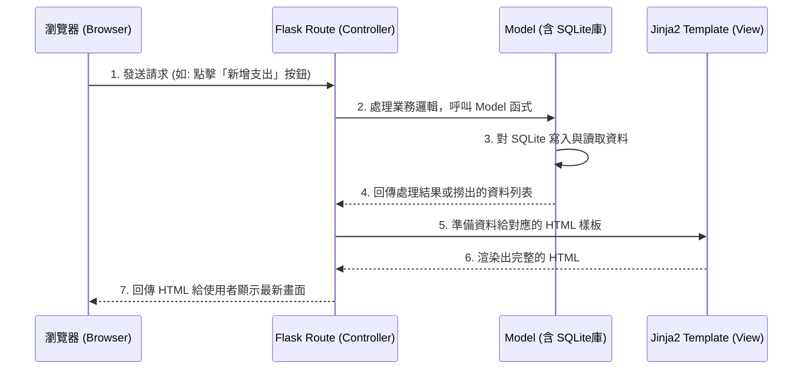

# 系統架構文件 (ARCHITECTURE) - 個人記帳簿系統

## 1. 技術架構說明

本專案是一個輕量級的 Web 應用程式，專注於簡單、流暢的單機/線上個人記帳體驗。

- **選用技術與原因**：
  - **後端框架：Python + Flask**。Flask 是一個輕量且彈性的 Python Web 框架，非常適合用來快速開發中小型應用（如個人記帳系統），且學習曲線平緩，對初學者友善。
  - **前端渲染：Jinja2**。專案沒有使用前後端分離，直接在後端將資料嵌入 HTML 中進行伺服器端渲染 (Server-Side Rendering)，藉此省去處理跨網域 (CORS) 或是撰寫繁複 API 介面的步驟。
  - **資料庫：SQLite**。以單一檔案的形式存放所有資料，不需要額外架設資料庫伺服器，建置與備份皆極為方便。

- **Flask MVC 模式說明**：
  - **Model (模型)**：負責定義資料表結構（例如：記帳紀錄、類別、預算設定），並負責與 SQLite 進行讀寫與互動。
  - **View (視圖)**：負責呈現畫面，由 Jinja2 模板（`.html` 檔案）組成，接收從 Controller 傳來的資料並轉化為使用者可見的 HTML 網頁。
  - **Controller (控制器)**：由 Flask 的路由 (Routes) 擔任，負責接收使用者的網頁請求、呼叫對應的 Model 取得或寫入資料，最後把資料拋給 View 以渲染最終結果。

---

## 2. 專案資料夾結構

為了使專案易於後續的維護與擴充，我們將依照模組與職責劃分資料夾結構，如下所示：

```text
web_app_development/
├── app/                      ← 應用程式的主要程式碼模組
│   ├── models/               ← 資料庫模型 (Models)：與 SQLite 互動的邏輯
│   │   ├── __init__.py       
│   │   └── database.py       ← SQLite 初始化及資料表 CRUD (建立、讀取、更新、刪除) 邏輯
│   │
│   ├── routes/               ← Flask 路由 (Controllers)：處理使用者的 Requests
│   │   ├── __init__.py       
│   │   ├── record.py         ← 收支紀錄的新增、刪除、修改、搜尋過濾邏輯
│   │   ├── category.py       ← 類別管理及圓餅圖統計等邏輯
│   │   └── dashboard.py      ← 月度總覽與首頁路由
│   │
│   ├── templates/            ← Jinja2 HTML 模板 (Views)
│   │   ├── base.html         ← 共用的網頁骨架 (導覽列、響應式選單、頁尾等)
│   │   ├── dashboard.html    ← 首頁/月度收支總覽與預算提醒畫面
│   │   ├── records.html      ← 紀錄列表 (支援搜尋與篩選)
│   │   └── form.html         ← 新增/修改單筆紀錄的表單頁面
│   │
│   └── static/               ← 靜態資源 (CSS / JS / 圖片)
│       ├── css/style.css     ← 負責美化系統畫面的樣式表
│       └── js/main.js        ← 前端小互動邏輯 (如表單驗證、操作確認)
│
├── instance/                 ← 不上傳版控的執行時期檔案存放處
│   └── database.db           ← SQLite 實體資料庫檔案 
│
├── docs/                     ← 專案文件目錄
│   ├── PRD.md                ← 產品需求文件
│   └── ARCHITECTURE.md       ← 系統架構文件 (本文件)
│
├── app.py                    ← 專案進入點：初始化 Flask 與註冊 Blueprints
└── requirements.txt          ← Python 套件清單 (flask 等相依套件)
```

---

## 3. 元件關係圖

以下展示當使用者透過瀏覽器操作網站時，MVC 各元件的互動關係流：



---

## 4. 關鍵設計決策

1. **捨用前後端分離，選擇伺服器端渲染 (Jinja2 SSR)**：
   - **原因**：為了加速 MVP (Minimum Viable Product) 的開發與概念驗證，且系統需求不牽涉龐大的互動應用，透過 Flask 內建的樣板引擎直接輸出 HTML，可以免除建立繁瑣的 RESTful APIs 設計與前後端對接的驗證。
2. **採用藍圖 (Flask Blueprints) 機制進行開發**：
   - **原因**：如果不加以分類，將幾十個功能的路由都寫在 `app.py` 中，會使得主檔案過於肥大難以維護。因此設計提早按功能（記錄、類別、主看版）劃分成多個 Blueprint 檔案（位於 `app/routes/` 之下），讓職責與結構更乾淨。
3. **選擇 SQLite 做為唯一資料落地方案**：
   - **原因**：個人記帳系統的使用情境屬於「資料結構單純、併發連線次數少」，因此非常適合輕量級且無需安裝服務元件的檔案型資料庫 (SQLite)。只要專案下載下來，安裝好 Python 套件立刻就能跑，提供開發與部署極大的便利性。
