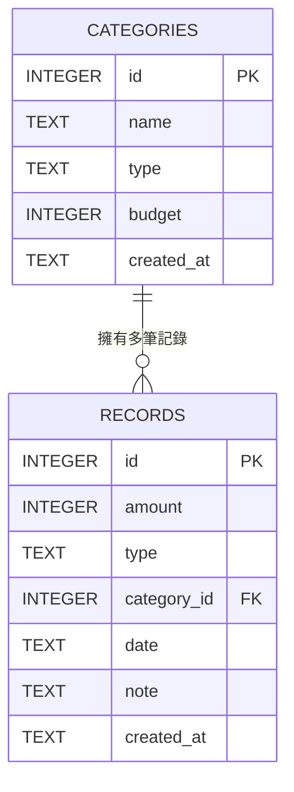

# 資料庫設計文件 (DB DESIGN) - 個人記帳簿系統

## 1. ER 圖（實體關係圖）

## 2. 資料表詳細說明

### 2.1 CATEGORIES (類別表)
負責儲存系統內建或使用者自訂的收支類別，並可設定該類別的防爆限額預算。

| 欄位名稱 | 型別 | 必填 | 說明 |
| --- | --- | --- | --- |
| `id` | INTEGER | 是 | Primary Key 自動遞增，唯一識別碼 |
| `name` | TEXT | 是 | 收支類別名稱 (如：餐飲、交通、薪水) |
| `type` | TEXT | 是 | 資料類型： `income` (收入) 或是 `expense` (支出) |
| `budget` | INTEGER | 否 | 每月預算設定，如無設定上限則填寫為 NULL |
| `created_at` | TEXT | 是 | 系統建檔時間 (ISO 格式字串，例如 `2024-05-18T10:00:00Z`) |

### 2.2 RECORDS (收支紀錄表)
負責儲存使用者實際的每一筆收入與支出帳目明細。

| 欄位名稱 | 型別 | 必填 | 說明 |
| --- | --- | --- | --- |
| `id` | INTEGER | 是 | Primary Key 自動遞增，唯一識別碼 |
| `amount` | INTEGER | 是 | 紀錄金額 (預期使用絕對值整數) |
| `type` | TEXT | 是 | 資料類型： `income` 或是 `expense` |
| `category_id` | INTEGER | 是 | Foreign Key，關聯至 `CATEGORIES.id` 以產生實體綁定 |
| `date` | TEXT | 是 | 消費或收入發生的所屬日期 (格式 `YYYY-MM-DD`) |
| `note` | TEXT | 否 | 其他額外備註 |
| `created_at` | TEXT | 是 | 系統建檔時間 (ISO 格式字串) |
