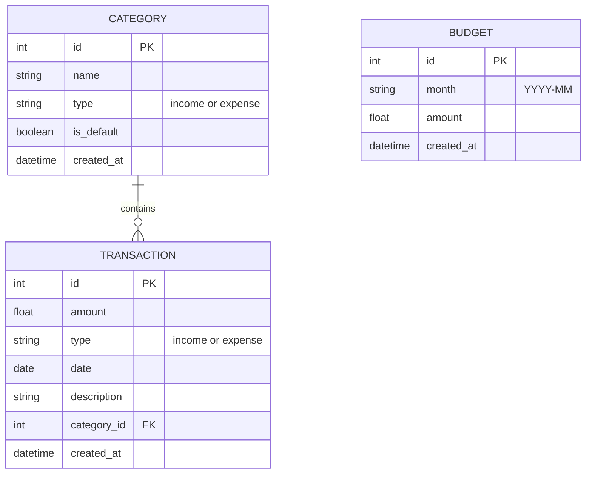

# 資料庫設計文件 (Database Design)

根據產品需求與流程圖，本專案採用 SQLite 作為資料庫，並使用 SQLAlchemy 進行物件關聯對映 (ORM)。

## 1. ER 圖（實體關係圖）

## 2. 資料表詳細說明

### 2.1 CATEGORY (收支類別)
儲存系統預設或使用者自訂的收支類別。
- `id` (INTEGER): 主鍵，自動遞增。
- `name` (TEXT): 類別名稱 (如：餐飲、交通、薪水)，必填。
- `type` (TEXT): 類型 (`income` 或 `expense`)，必填。
- `is_default` (BOOLEAN): 是否為系統預設類別，預設為 `False`。
- `created_at` (DATETIME): 建立時間，預設為當前時間。

### 2.2 TRANSACTION (收支紀錄)
儲存使用者的每一筆收入或支出紀錄。
- `id` (INTEGER): 主鍵，自動遞增。
- `amount` (REAL): 金額，必填。
- `type` (TEXT): 類型 (`income` 或 `expense`)，必填。
- `date` (DATE): 發生日期，必填。
- `description` (TEXT): 備註說明，選填。
- `category_id` (INTEGER): 外鍵，關聯至 `CATEGORY.id`，必填。
- `created_at` (DATETIME): 建立時間，預設為當前時間。

### 2.3 BUDGET (月度預算)
儲存每個月設定的預算金額。
- `id` (INTEGER): 主鍵，自動遞增。
- `month` (TEXT): 月份字串 (格式: `YYYY-MM`)，必填且唯一。
- `amount` (REAL): 預算金額，必填。
- `created_at` (DATETIME): 建立時間，預設為當前時間。
