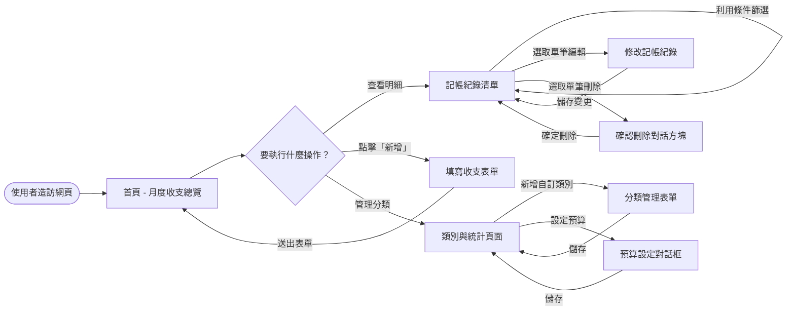
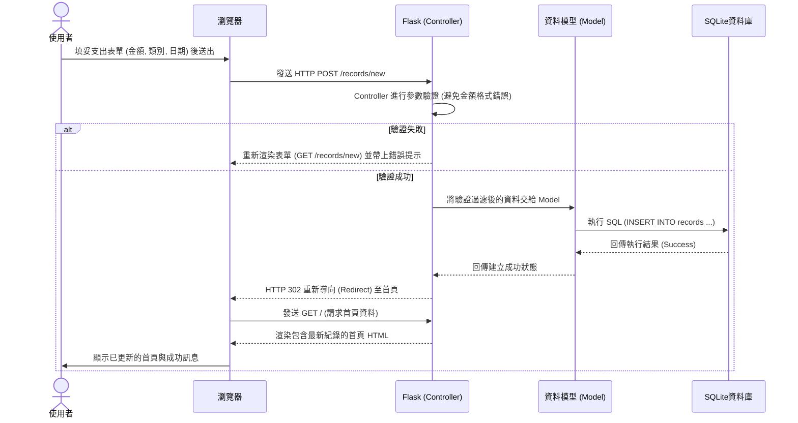

# 系統流程圖與使用者流程 (FLOWCHART) - 個人記帳簿系統

## 1. 使用者流程圖 (User Flow)

這份流程圖展示了使用者造訪網站後，可以採取的主要行動路徑。

## 2. 系統序列圖 (Sequence Diagram)

這份序列圖描述了核心功能：「使用者點擊新增一筆支出」到「資料成功存入資料庫」的完整技術流程。

## 3. 功能清單對照表

將上述的使用者體驗與系統操作轉化為對應的 URL 路徑與 HTTP 方法清單。

| 功能名稱 | URL 路徑 | HTTP 方法 | 說明 |
| --- | --- | --- | --- |
| 月度收支總覽 | `/` 或 `/dashboard` | GET | 網站首頁，顯示當月總收支、餘額與預算概況 |
| 記帳紀錄清單 | `/records` | GET | 顯示所有紀錄明細，可使用 URL Query String 進行搜尋篩選 (例: `?month=2024-05`) |
| 新增收支紀錄 | `/records/new` | GET, POST | GET: 取得並渲染空白表單 POST: 接收表單欄位進資料庫 |
| 編輯單筆紀錄 | `/records/<id>/edit` | GET, POST | GET: 取得欲修改的資料並填入表單 POST: 儲存修改過的新資料 |
| 刪除單筆紀錄 | `/records/<id>/delete`| POST | 以發送表單的方式對系統請求刪除該筆資料 |
| 類別清單與統計 | `/categories` | GET | 列出消費分類並顯示占比圓餅圖 |
| 新增自訂類別 | `/categories/new` | GET, POST | GET: 渲染建立類別表單 POST: 將新類別存入資料庫 |
| 設定類別預算 | `/categories/<id>/budget`| POST | 提交表單以更新對應分類的預算上限 |
