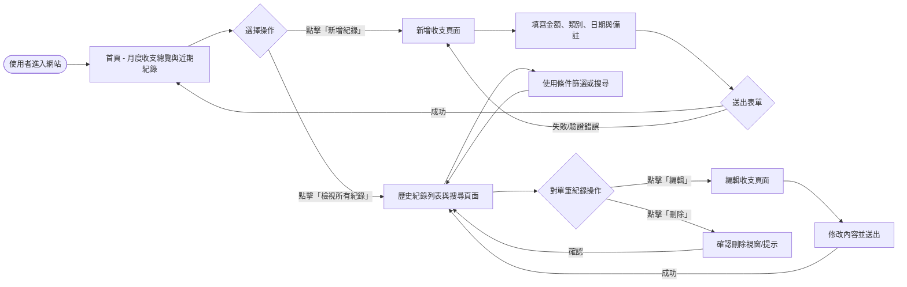
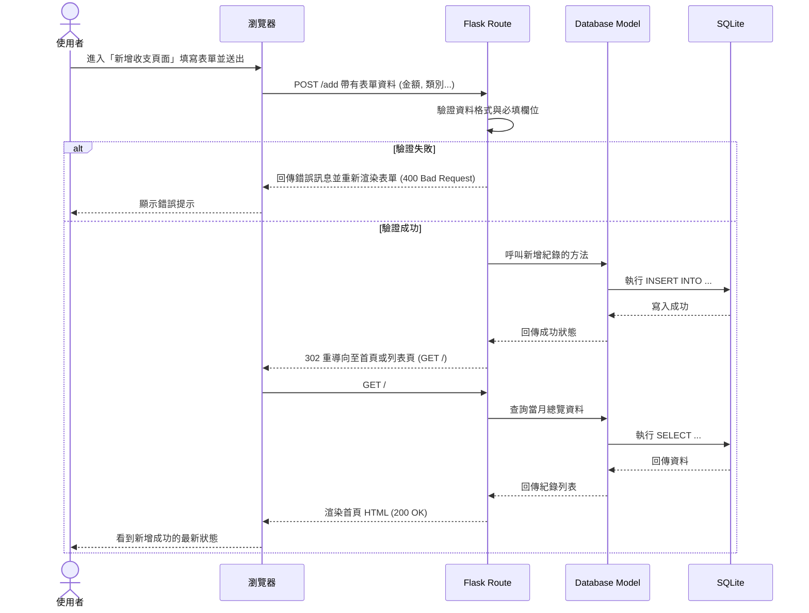

# 系統流程圖與使用者流程 (Flowchart)

根據 PRD 與系統架構設計，以下為個人記帳簿系統的流程規劃。

## 1. 使用者流程圖（User Flow）

此流程圖展示了使用者在網站上可以執行的所有主要操作路徑，包含瀏覽總覽、新增、編輯、刪除收支紀錄等功能。

## 2. 系統序列圖（Sequence Diagram）

此序列圖詳細描述了使用者執行「新增一筆收支紀錄」時，系統內部從前端瀏覽器、後端 Flask 路由、資料庫模型到 SQLite 的完整互動過程。

## 3. 功能清單對照表

以下為針對系統主要功能所規劃的對應 URL 路由結構：

| 功能描述 | URL 路徑 | HTTP 方法 | Controller 負責動作 | View (Jinja2) |
| :--- | :--- | :--- | :--- | :--- |
| **月度收支總覽/首頁** | `/` | `GET` | 取得當月總收支、預算狀態與近期紀錄，渲染首頁 | `index.html` |
| **新增收支紀錄 (頁面)** | `/add` | `GET` | 渲染新增表單頁面 | `add.html` |
| **新增收支紀錄 (送出)** | `/add` | `POST` | 接收表單資料，寫入資料庫，成功後重導向至首頁 | *(無，處理後重導向)* |
| **歷史紀錄列表** | `/transactions` | `GET` | 取得所有紀錄，處理搜尋與篩選條件，渲染列表 | `list.html` |
| **編輯收支紀錄 (頁面)** | `/edit/<id>` | `GET` | 依據 ID 取得單筆紀錄，渲染編輯表單 | `add.html` (共用) |
| **編輯收支紀錄 (送出)** | `/edit/<id>` | `POST` | 接收修改資料，更新資料庫，成功後重導向至列表 | *(無，處理後重導向)* |
| **刪除收支紀錄** | `/delete/<id>` | `POST` | 依據 ID 刪除該筆紀錄，成功後重導向至列表 | *(無，處理後重導向)* |
